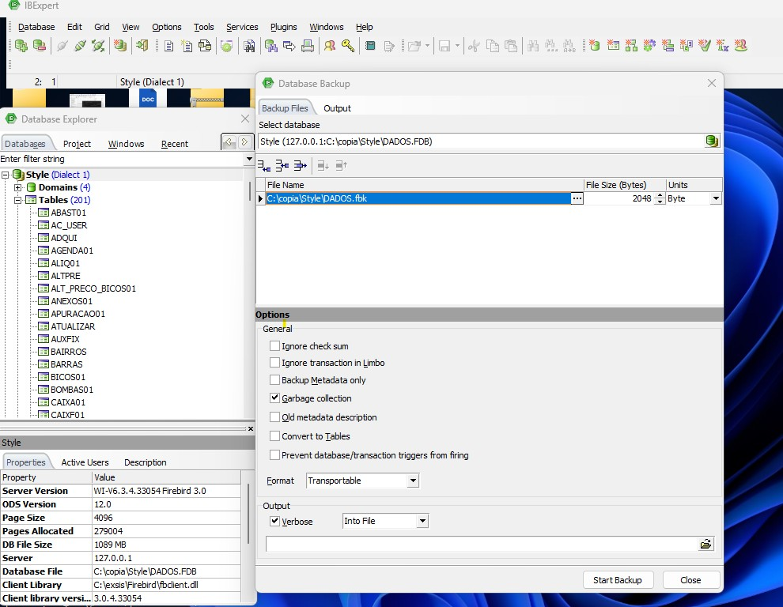
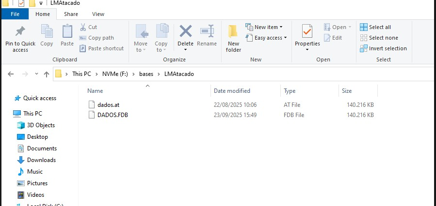
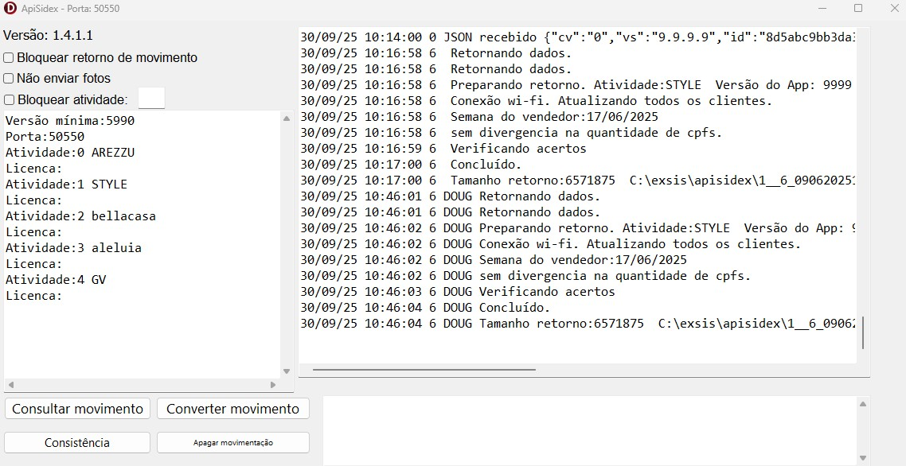
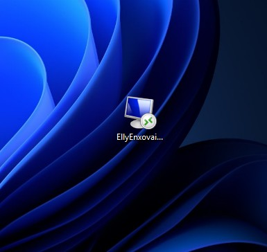
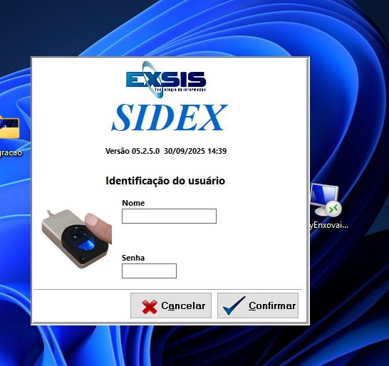
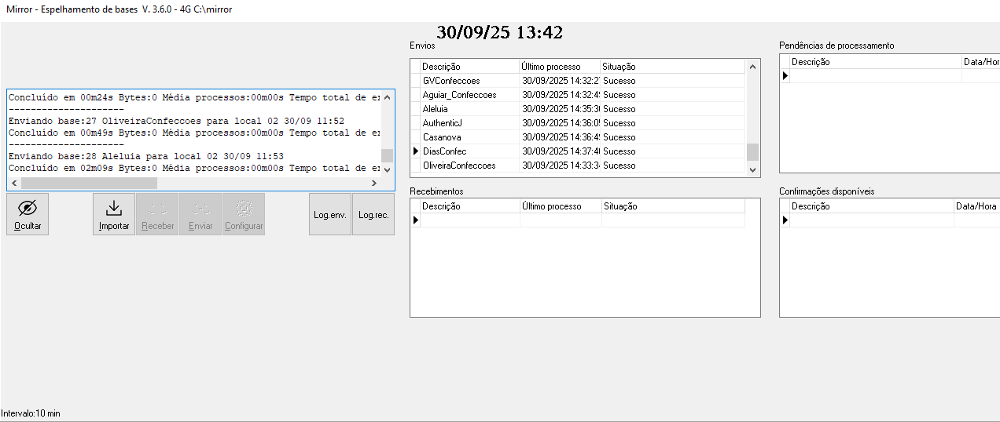

# Migração completa de ambiente ERP, API, banco de dados, usuarios e acessos RDP para nuvem EVEO
Projeto de migração de ERP local para a nuvem EVEO, incluindo API, banco Firebird e configuração de acessos via RDP, com backup automatizado e alta disponibilidade.
# ☁️ Projeto de Migração de ERP para a Nuvem (EVEO)

Este projeto documenta o processo de migração de um ambiente ERP hospedado em servidor local para uma infraestrutura em nuvem (EVEO), com foco em estabilidade, segurança e disponibilidade. A experiência do usuário final foi mantida, com o sistema operando sem mudanças visuais ou estruturais.

---

## 📌 Etapas da Migração

### 1️⃣ Backup da Base de Dados (Firebird)

- Backup do banco realizado via IBExpert, gerando arquivo `.fbk`.
- Arquivo compactado em `.rar` para envio à nuvem.

---

### 2️⃣ Envio e Restauração na Nuvem

- Arquivo `.fbk` transferido para o servidor EVEO.
- Descompactado e restaurado para `.fdb` com sucesso.

---

### 3️⃣ Configuração de Caminhos e Integrações

- Caminhos do banco e diretórios ajustados no sistema.
- Diretórios mapeados para o novo ambiente em nuvem.

---

### 4️⃣ Configuração da API

- API do ERP reconfigurada para comunicação com o novo servidor.
- Atualizados endpoints e variáveis de ambiente conforme a nova estrutura.
- Testes realizados para garantir sincronização entre sistema e aplicativo.

---

### 5️⃣ Criação de Usuários e Permissões

- Contas de usuários criadas no Windows Server.
- Permissões de acesso ajustadas para empresas e grupos.

---

### 6️⃣ Acesso Remoto via Atalho (RDP)

- Criado atalho personalizado na área de trabalho dos clientes para acesso via RDP.
- A experiência de uso se manteve familiar para o usuário final.

---

### 7️⃣ Tela de Login Validada

- Acesso ao sistema testado e validado no novo ambiente.
- Nenhuma mudança na interface do sistema ERP.

---

### 8️⃣ Configuração do Backup Automático (Mirror)

- Instalado e configurado programa de espelhamento para backups a cada 10 minutos.
- Sincronização em tempo real entre dados locais e backup seguro.

---

## 🧱 Antes e ☁️ Depois

### Antes (Servidor Local):
- Sistema operava localmente, com risco de falha física.

---

### Depois (Servidor na Nuvem):
- Ambiente centralizado e acessível via RDWeb/RDP.
- Backups automáticos e maior estabilidade.

---

## ✅ Resultados da Migração

- 🌐 Acesso remoto facilitado e centralizado  
- 🔐 Segurança e controle de acesso aprimorados  
- 📦 Backups automatizados e confiáveis  
- ⚙️ API e integrações operando normalmente  
- 🧘‍♂️ Nenhuma mudança na usabilidade para o cliente final  
- 💰 Redução de riscos e custos com infraestrutura local  

